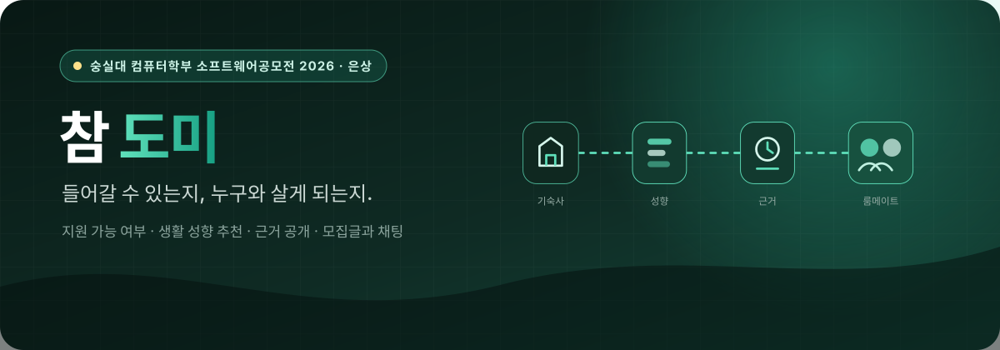

  

  <a href="https://chamdomi.vercel.app"><strong>서비스 사용해 보기</strong></a>

## 들어갈 수 있는지, 누구와 살게 되는지

참도미는 기숙사 지원을 앞둔 대학생을 위한 서비스입니다. 모집 공고를 직접 읽고 점수를 계산해
지원 가능 여부를 가늠하던 일, 룸메이트를 구하려고 여러 커뮤니티 글을 뒤지던 일을 하나의 화면으로
모았습니다. 생활 성향을 입력하면 성향이 맞는 사람을 추천하고, **왜 그 사람이 추천되었는지 항목별
근거를 함께 보여 줍니다.**

> 숭실대학교 컴퓨터학부 소프트웨어공모전 2026 은상 수상

## 우리가 없앤 일

| Before | After |
| --- | --- |
| 기숙사 모집 공고 PDF를 찾아 직접 읽음 | 수집·정리된 모집 정보를 화면에서 확인 |
| 선발 기준을 보고 지원 가능 여부를 어림짐작 | 입력한 조건으로 지원 가능 여부를 확인 |
| 커뮤니티 글을 뒤져 룸메이트를 구함 | 생활 성향 기반 추천과 공개 모집글 |
| "왜 이 사람인지" 알 수 없는 추천 | 항목별 궁합 근거를 펼쳐서 확인 |
| 구한 뒤 외부 메신저로 이동 | 1:1 문의와 모집글 단톡방을 서비스 안에서 |

## 설명할 수 있는 추천

추천 점수는 수면 패턴, 흡연, 청소 빈도, 소음, 소통, 성격, 온도, 물건 공유 같은 생활 성향 항목의
기여도를 합산해 만듭니다. 사용자는 총점만 받는 것이 아니라 **어떤 항목이 얼마나 맞았는지** 펼쳐서
확인할 수 있습니다. 절대 같이 못 사는 조건은 점수 계산 전에 걸러내는 하드 필터로 처리합니다.

**핵심 점수와 하드 필터에는 LLM을 쓰지 않습니다.** 입력이 정해진 범주이고, 같은 입력은 항상 같은
결과가 나와야 하며, 화면 미리보기와 서버 판정이 어긋나면 안 되기 때문입니다. 두 구현은 같은 golden
fixture로 함께 검증하고, 최종 판정 권한은 서버에 둡니다. 생성 모델을 넣으면 추천 품질의 근거 없이
비용·지연·비결정성만 늘어난다고 판단했습니다.

관리자 자동 배정은 Robert W. Irving의 **Stable Roommates** 2-phase 알고리즘을 사용합니다. 전체
점수 합을 최대화하는 방식은 총합은 높여도 개인별 안정성을 보장하지 않으므로, blocking pair가 없는
안정 매칭을 목표로 선택했습니다. 안정 매칭이 존재하지 않는 입력도 있으며 그때는 응답이 그 사실을
그대로 알려 줍니다. 구현은 완전 탐색 오라클과 대조해 검증합니다.

## 신뢰할 수 있는 제품 경계

- 브라우저는 백엔드 원본이나 장기 토큰에 직접 접근하지 않습니다. 동일 출처 BFF가 프록시합니다.
- 로그인 토큰은 URL에 실리지 않습니다. 일회용 코드와 HttpOnly 쿠키를 한 번 교환해 발급합니다.
- 실시간 채팅은 짧은 만료의 1회용 티켓으로만 연결하고, 세션 자격증명을 브라우저에 노출하지 않습니다.
- 모집글 수정·삭제 권한은 화면 제어가 아니라 서버의 작성자 검사로 강제합니다.
- 런타임 mock이나 가짜 fallback 데이터가 없습니다. 백엔드가 응답하지 않으면 실제 오류를 표시합니다.
- 새 멤버는 승인 전 대화 내용을 볼 수 없고, 메시지는 재시도해도 중복 저장되지 않습니다.
- 운영은 논리 백업과 복구 검증을 거친 뒤에만 배포하고, 스키마가 적용된 변경은 자동 롤백하지 않습니다.

## 기술 스택

| 영역 | 사용 기술 |
| --- | --- |
| Product | Next.js 16 App Router, React 19, TypeScript, Tailwind CSS v4 |
| BFF · Auth | 동일 출처 프록시, Google · Kakao OAuth, HttpOnly 세션 |
| API | Spring Boot 4, Java 17, Spring Security, JPA |
| Data | MySQL 8, Flyway |
| Realtime | STOMP over WebSocket, Web Push |
| Delivery | k3s, Helm, GitHub Actions, Prometheus |
| Contract | OpenAPI 스냅샷에서 프론트엔드 타입 생성 |

REST 계약은 백엔드 구현에서 생성한 OpenAPI 명세가 기준입니다. CI가 명세를 다시 생성해 커밋된
계약과 실제 구현이 어긋나면 실패하므로, 공개 경로나 DTO를 바꾸는 변경은 프론트엔드 타입과 함께
갱신됩니다.

## 저장소

제품 코드(`FE`, `BE`, `infra`)는 비공개입니다. 동작하는 서비스는
[chamdomi.vercel.app](https://chamdomi.vercel.app)에서 바로 확인할 수 있습니다.

## 팀

숭실대학교 학생 3인이 기획·개발했습니다.

[@gangdogang](https://github.com/gangdogang) ·
[@ghdtjdwn](https://github.com/ghdtjdwn) ·
[@sammool](https://github.com/sammool)

  <a href="https://chamdomi.vercel.app"><strong>참도미 열어보기 →</strong></a>

