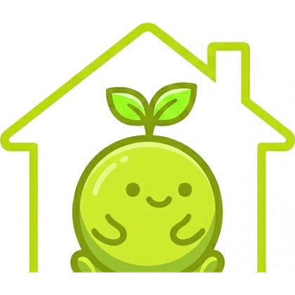
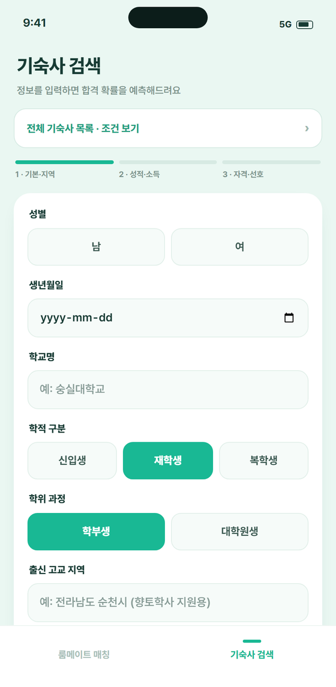
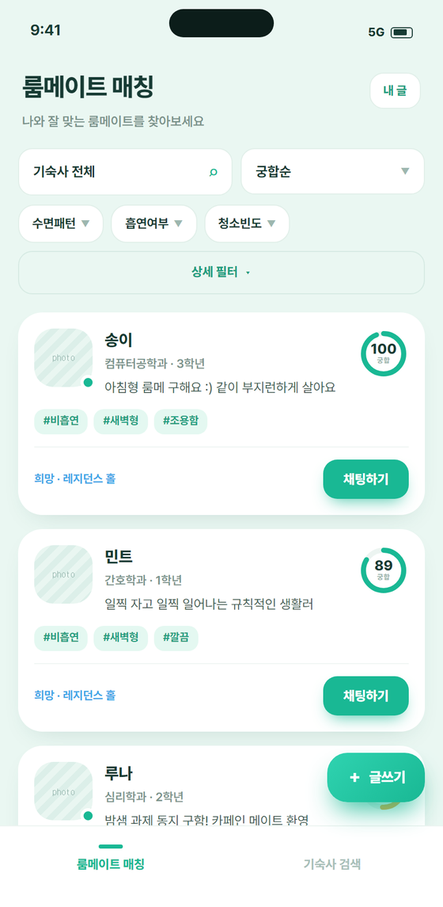
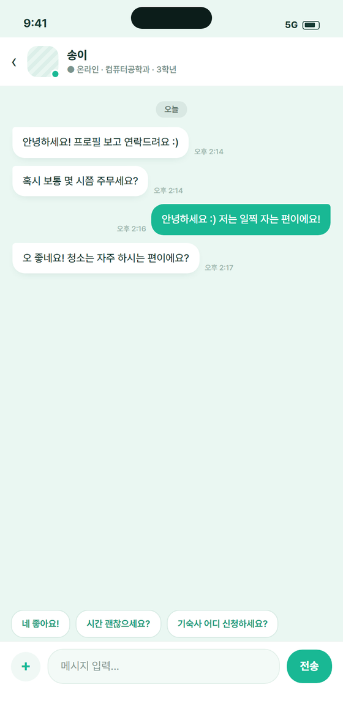

  

<h2 align="center">참도미</h2>

  기숙사에 들어갈 수 있는지, 그리고 누구와 살게 되는지.

  <a href="https://chamdomi.vercel.app"><strong>서비스 »</strong></a>

<table align="center">
  <tr>
    <td width="33%"></td>
    <td width="33%"></td>
    <td width="33%"></td>
  </tr>
</table>

### 궁합 89점, 왜 89점인지까지

대부분의 성향 추천은 결론만 건네줍니다. 참도미는 수면 패턴, 흡연, 청소 빈도, 소음, 소통, 성격,
온도, 물건 공유 — 여덟 항목이 각각 점수에 얼마나 기여했는지 펼쳐서 보여 줍니다. 도저히 같이 살 수
없는 조건은 점수를 매기기 전에 걸러냅니다.

**이 계산에 LLM은 없습니다.** 같은 입력은 항상 같은 점수여야 하고, 화면의 미리보기와 서버의 판정이
어긋나면 안 됩니다. 두 구현을 같은 golden fixture로 함께 검증하고 최종 판정은 서버가 합니다.
여기에 생성 모델을 얹으면 추천이 좋아진다는 근거 없이 비용과 지연, 비결정성만 늘어납니다.

### 총합보다 안정성

자동 배정은 Robert W. Irving의 **Stable Roommates**입니다. 점수 총합을 최대화하는 배정은 평균
만족도는 올려도 서로 바꾸고 싶어 하는 짝(blocking pair)을 남깁니다. 참도미는 그 짝이 남지 않는
배정을 택했고, 완전 탐색 오라클과 대조해 검증했습니다. 안정 매칭이 아예 존재하지 않는 입력도
있는데, 그때는 없다고 그대로 답합니다.

### 만든 방식

`Next.js 16` `React 19` `Spring Boot 4` `MySQL` `STOMP` `k3s` `Helm`

브라우저는 백엔드 원본이나 장기 토큰에 직접 닿지 않고 동일 출처 BFF를 거칩니다. 로그인 토큰은 URL에
실리지 않습니다. REST 계약은 백엔드 구현에서 생성한 OpenAPI 명세가 기준이고, CI가 명세를 다시
생성해 구현과 어긋나면 빌드를 깹니다. 런타임 mock은 두지 않았습니다. 백엔드가 죽으면 화면에는
가짜 데이터가 아니라 실제 오류가 뜹니다.

  숭실대학교 컴퓨터학부 소프트웨어공모전 2026 · <strong>은상</strong>

  <a href="https://github.com/gangdogang">@gangdogang</a> ·
  <a href="https://github.com/ghdtjdwn">@ghdtjdwn</a> ·
  <a href="https://github.com/sammool">@sammool</a>

